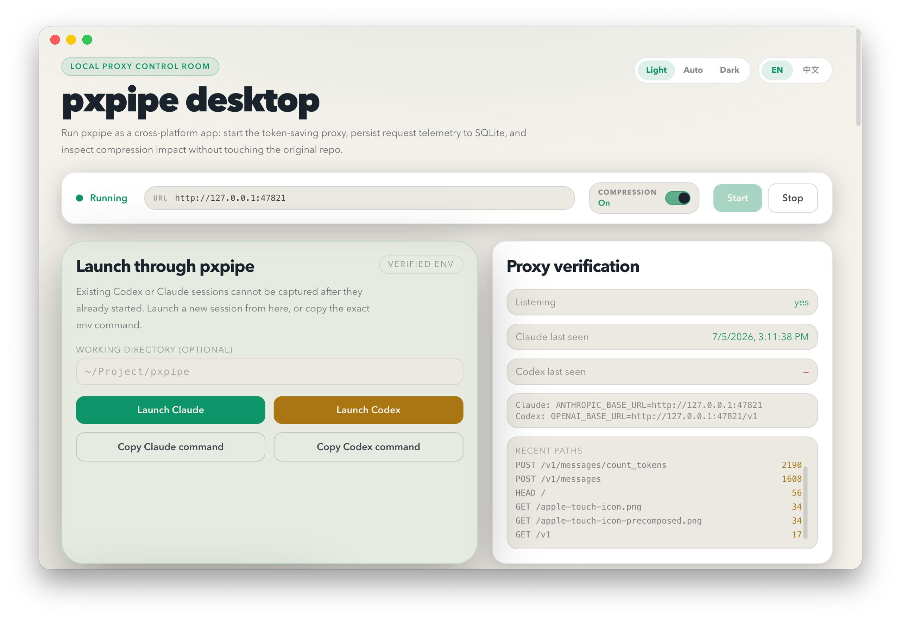

# pxpipe-app

English version: [README.md](./README.md)

pxpipe-app 是 pxpipe proxy 的桌面控制台。它使用 Electron、React 和 Tailwind CSS 构建，用来启动本地代理、查看请求遥测、检查图片压缩效果，并管理 Claude / Codex 的代理启动方式。

pxpipe 的核心能力是把大段输入上下文渲染成紧凑的 PNG 图片，从而减少模型请求中的输入 token。pxpipe-app 不替代核心代理，而是提供一个更容易操作和观察的桌面界面。



## 功能概览

- **代理控制**：启动、停止本地 pxpipe proxy，查看当前监听地址。
- **Compression 开关**：运行时启用或关闭图片压缩，不需要重启 App。
- **请求列表**：查看最近请求的时间、状态、路径、模型、输入、输出、缓存读取和节省量。
- **Token image inspector**：选择请求后查看哪些输入内容被渲染为 PNG，以及图片背后的源文本。
- **成本与定价**：展示输入节省、成本拆分、缓存折扣和估算节省金额。
- **会话统计**：按会话聚合请求数、节省 token 和项目路径。
- **模型 allowlist**：通过模型芯片控制哪些模型允许使用图片压缩。
- **历史导入**：将 `~/.pxpipe/events.jsonl` 导入到 App 的 SQLite 数据库。
- **中英文切换**：界面支持 English / 中文，并会持久化语言偏好。
- **菜单栏监控（macOS）**：圆形菜单栏图标，左键打开 popover 查看代理状态、启停与压缩开关、今日节省和最近 24 小时趋势；右键弹出快捷菜单。

## 工作原理

pxpipe-app 启动一个本地代理，默认地址为：

```text
http://127.0.0.1:47821
```

Claude Code、Codex 或其他兼容 API 客户端需要显式把请求发到这个代理。代理收到请求后，会判断模型、路径和输入内容是否适合压缩。只有符合条件的输入块会被渲染为 PNG 图片；其他内容会保持文本透传。

代理现在会把无法识别的 API 路径直接透传给上游（pass-through 路由），因此客户端指向
pxpipe 时，非聊天类端点也能正常工作。

常见会被压缩的内容包括：

- 大段工具输出；
- 旧的对话历史；
- 系统提示词和工具说明等静态上下文。

以下内容通常不会被压缩：

- 最新用户请求；
- 模型输出；
- 太短或太稀疏的文本；
- 不在 allowlist 中的模型；
- 不支持图片输入的请求形态。

## 模型兼容性与图片效果

pxpipe 主项目对模型范围采用保守默认值。默认推荐并启用图片压缩的模型是：

| 模型 | 默认状态 | 图片化上下文效果 |
| --- | --- | --- |
| `claude-fable-5` | 默认启用 | 主项目验证效果最好，是 Claude 路径的默认图片读取模型。 |
| `gpt-5.6` | 默认启用 | GPT 路径的默认启用模型，适合图片化上下文。 |
| `gpt-5.5` | 可选启用 | 主项目说明其在图片化 history/context 上表现变差，因此默认不启用。 |
| `claude-opus-4-7` / `claude-opus-4-8` | 可选启用 | 主项目说明 Opus 4.7 / 4.8 存在图片误读风险，适合实验，不适合作为默认值。 |
| 其他模型 | 默认透传文本 | 除非加入 allowlist，并且请求通过压缩门控，否则不会生成图片。 |

即使模型已经加入 allowlist，pxpipe 也不会无条件生成 PNG。代理还会检查输入块的大小、文本密度和图片 token 成本。只有图片化更划算时，请求才会显示 `image ×N` 或 `图片 ×N`。

如果你选择了 `gpt-5.5`，但 Recent requests 仍显示 `text` / `文本`，这通常不是 App 出错，而是主项目的保守策略或压缩门控在生效。

> 注：GPT（Responses）路径的节省统计已排除图片 base64 内容，展示的节省数据是准确的。

## 为什么使用 ChatGPT 时没有图片压缩

ChatGPT 网页版或桌面版本身不会自动走本地 pxpipe 代理。pxpipe 只能处理显式指向它的 API 请求，例如 Codex 或 OpenAI API 客户端使用：

```bash
OPENAI_BASE_URL=http://127.0.0.1:47821/v1 codex
```

因此，如果你是在 chatgpt.com 或 ChatGPT 官方 App 中聊天，请求通常不会经过 pxpipe，也就不会出现图片压缩。

即使请求已经经过 pxpipe，也不一定每次都会生成图片。pxpipe 还会检查模型是否在 allowlist 中、内容是否足够大、图片成本是否低于文本成本。没有满足条件时，请求会以普通文本透传。

## 快速开始

### 安装依赖

```bash
pnpm install
```

首次安装或切换 Electron 版本后，项目会重建 `better-sqlite3` 原生依赖。这个过程可能需要一些时间。

### 开发启动

```bash
pnpm dev
```

启动后，在桌面 App 中点击 **Start**。代理启动后，可以从界面复制 Claude 或 Codex 启动命令。

### 生产构建

```bash
pnpm build
```

平台打包命令：

```bash
pnpm build:mac
pnpm build:win
pnpm build:linux
```

## 使用方式

### 启动 Claude

在 pxpipe-app 中点击 **Launch Claude**，或手动运行：

```bash
ANTHROPIC_BASE_URL=http://127.0.0.1:47821 claude
```

### 启动 Codex

在 pxpipe-app 中点击 **Launch Codex**，或手动运行：

```bash
OPENAI_BASE_URL=http://127.0.0.1:47821/v1 codex
```

### 使用 OpenAI API 客户端

将 OpenAI 客户端的 base URL 指向本地代理：

```text
http://127.0.0.1:47821/v1
```

如果需要由 pxpipe-app 代为设置 OpenAI API Key，可以在 App 的设置中填写 OpenAI upstream 和 API Key。也可以让调用方自己传入 `Authorization` header。

## 界面说明

### 状态卡

右上角状态卡显示代理是否运行、当前代理地址、Start / Stop 按钮，以及 Compression 开关。

Compression 关闭后，请求仍会经过代理，但不会把输入渲染为 PNG。这个开关适合做 A/B 对比，或临时排查图片压缩带来的行为差异。

### Launch through pxpipe

这个区域用于启动新的 Claude 或 Codex 会话。已经启动的终端会话不会自动接入 pxpipe，需要重新启动或手动设置 base URL。

### Proxy verification

这个区域检查代理是否正在监听，以及 Claude / Codex 最近是否有请求经过代理。若这里长期显示没有流量，通常说明客户端没有指向 `http://127.0.0.1:47821`。

### Recent requests

这里展示最近请求。带有 `image` / `图片` 标记的请求表示其中有输入内容被渲染成 PNG。点击这些行可以跳转到下方的 Token image inspector。

### Token image inspector

这个区域展示一次请求中的图片化内容，包括：

- 文本基线 token；
- PNG 图片数量；
- 实际发送 token；
- 图片预览；
- 图片背后的源文本。

它适合用来确认“哪些内容被压缩了”，以及排查某次请求为什么没有生成图片。

### Cost & pricing

这个区域按代理采集到的遥测估算节省情况。估算结果会受到模型价格、缓存折扣、输出 token 和请求形态影响，因此应作为观测指标，而不是固定承诺。

### Proxy settings

这里可以修改监听地址、上游 API、模型 allowlist 和自动启动选项。模型 allowlist 决定哪些模型允许图片压缩；不在列表中的模型会透传文本。

### Import legacy JSONL

如果你之前使用过命令行版 pxpipe，可以将旧的事件日志导入桌面 App：

```text
~/.pxpipe/events.jsonl
```

导入后，App 会把历史请求写入 SQLite，并在 Recent requests、Sessions 和统计卡片中展示。

## 常见问题

### 为什么没有出现图片？

可能有以下原因：

- 客户端没有走本地代理；
- Compression 开关处于关闭状态；
- 模型不在 allowlist 中；
- 请求内容太短，不值得压缩；
- 请求内容太稀疏，图片 token 成本高于文本；
- 请求路径不是 pxpipe 支持的 API 形态。

### 为什么 Recent requests 没有新请求？

请先确认代理正在运行，并且客户端的 base URL 指向本地代理：

```text
http://127.0.0.1:47821
```

Claude 使用 `ANTHROPIC_BASE_URL`，Codex / OpenAI API 客户端使用 `OPENAI_BASE_URL`。

### 图片压缩会改变模型回答吗？

有可能。图片压缩是有损的，尤其不适合依赖逐字准确回忆的内容，例如 ID、哈希、密钥、精确数字和人名。pxpipe 会尽量保留最新请求和关键文本，但它不能保证所有图片内容都被模型逐字读准。

如果任务需要字节级准确性，可以关闭 Compression，或使用不在 allowlist 中的模型让请求透传文本。

### 为什么选择 GPT 5.5 后仍然是文本？

`gpt-5.5` 是可选启用模型，不是主项目默认推荐的图片读取模型。选择 GPT 5.5 后仍然显示文本，通常有以下原因：

- 需要点击 **Save settings**，再停止并重新启动代理，新的 allowlist 才会进入当前代理实例；
- 实际请求模型名不是 `gpt-5.5` 或 `gpt-5.5-*`；
- 请求内容太短或太稀疏，没有通过压缩门控；
- Compression 开关处于关闭状态；
- 客户端没有通过 `OPENAI_BASE_URL=http://127.0.0.1:47821/v1` 走本地代理；
- 你使用的是 ChatGPT 网页版或官方桌面 App，而不是可配置 base URL 的 API 客户端。

主项目 README 明确说明：GPT 5.5 在图片化上下文上表现变差，所以默认不 silently image。pxpipe-app 允许你把它加入 allowlist，但不承诺它一定会生成图片。

### ChatGPT 网页版能用吗？

不能直接使用。ChatGPT 网页版和官方桌面 App 不会自动把流量发送到本地 pxpipe 代理。pxpipe-app 主要面向 Claude Code、Codex，以及可配置 base URL 的 API 客户端。

### 语言设置保存在哪里？

语言设置和其他 App 设置一起保存到桌面 App 的 SQLite 数据库中。切换 English / 中文 后会立即生效，并在下次启动时恢复。

## 开发命令

```bash
pnpm dev              # 开发启动
pnpm typecheck        # TypeScript 类型检查
pnpm lint             # ESLint 检查
pnpm build            # 构建主进程、preload 和渲染进程
pnpm build:unpack     # 构建未打包应用
pnpm build:mac        # macOS 打包
pnpm build:win        # Windows 打包
pnpm build:linux      # Linux 打包
```

## 项目结构

```text
src/main/          Electron 主进程、SQLite、代理服务封装
src/preload/       preload API 暴露
src/renderer/      React 渲染进程界面
src/shared/        主进程和渲染进程共享类型
```

核心压缩逻辑来自相邻的 `pxpipe` 仓库，并通过 `pxpipe-proxy` 本地依赖引入：

```json
"pxpipe-proxy": "file:../pxpipe"
```

## 与 pxpipe 主项目的关系

pxpipe-app 是桌面控制台，核心压缩逻辑来自上游项目 pxpipe / `pxpipe-proxy`。当前仓库通过本地依赖引用相邻的主项目：

```json
"pxpipe-proxy": "file:../pxpipe"
```

上游项目主页：<https://github.com/teamchong/pxpipe>。

## 许可

pxpipe-app 使用 MIT License。分发包含 `pxpipe-proxy` 的构建产物时，应同时保留上游 pxpipe 项目的 MIT License 和版权声明。
